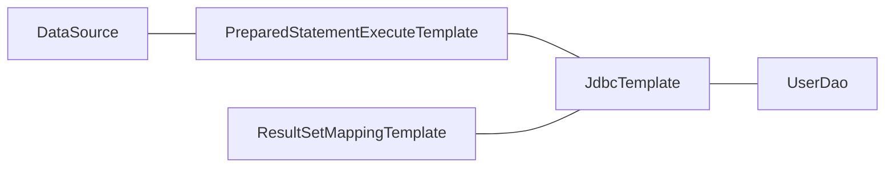

# JDBC 라이브러리 구현하기

## 1단계

- RowMapper
  - [x] 컬럼 매핑용 기능 구현
- JdbcTemplate
  - [x] 단건 조회 기능 구현
  - [x] 복수 조회 기능 구현
  - [x] 업데이트(executeUpdate) 기능 구현 

## 2단계

- [x] PreparedStatement 작업 처리 역할을 분리한다.
- [x] ResultSet 내 데이터를 매핑하는 역할을 분리한다.
- [x] 데이터베이스 쿼리 예외 발생시 DataAccessException 을 던지도록 수정한다.
